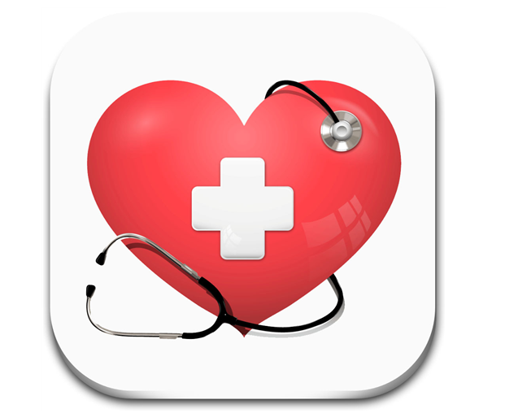

# 18234062 오주영

Hello my name is ju

## 2주차 과제

</img>

</img>

## 3주차 과제

</img>

</img>

## 4주차 과제

아이디어 앱: 건강검진앱

</img>

우리나라는 65세 이상 고령인구의 비율이 2018년에 14%를 넘어서면서 본격적인 고령화 사회로 진입했다. 독거노인 또한 증가하여 고독사문제도 사회문제로 야기되고 있다. 이러한 사회 문제점을 생각하여 이 앱을 개발해보았다. 이 앱은 최근 건강검진 기록을 볼 수 있고, 그 건강검진의 기록에 따라 건강의 문제가 있는지 확인할 수 있는 앱이다. 가족들과 공유할 수 있고, 가장 근처에 있는 병원과 공유하여 환자의 건강을 확인하고 건강검진을 할 기간이 오면 알림을 설정할 수 있게 만든 앱이다. 또한. 환자가 위급한 상황일 때 119전화로 바로 연결 가능한 버튼 또한 가지고 있다. 노인 뿐만 아니라 남녀노소 사용하여 건강상태를 확인 할 수 있는 앱이다. 
